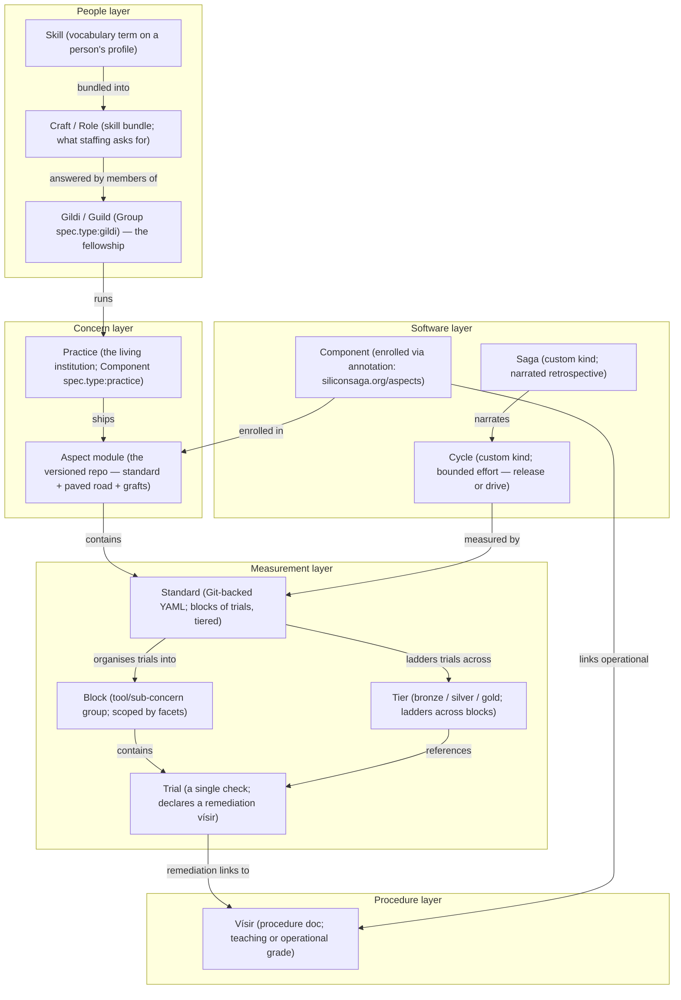
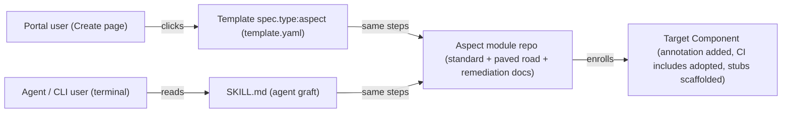
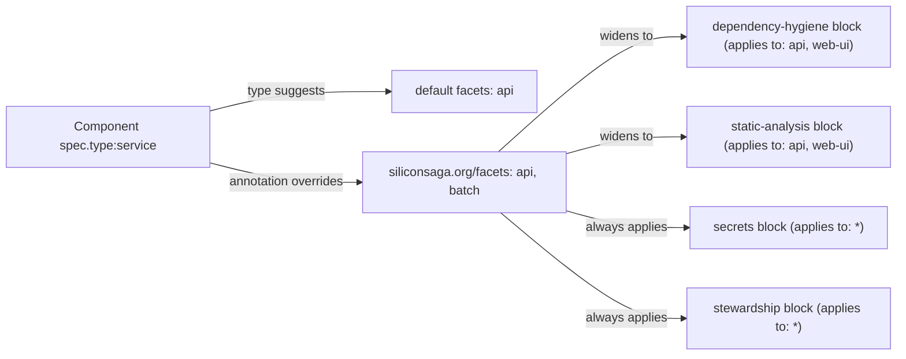

# Guildhall model — entity relationships

How the five Guildhall concepts map onto Backstage entity kinds and relate to each other.

## Concept map

## The split that carries the model

> **Crafts are what people do. Aspects are what components adopt. Standards are what they must then uphold.**

- A **craft** (Role) is demand-side: what a staffing request asks for.
- An **aspect** is supply-side: what a component takes on when it enrolls.
- A **standard** is the bar: a set of checks, organized by tool (blocks) and maturity (tiers).

## Graft — two doors, one module

## Facets — solving the multi-natured component

