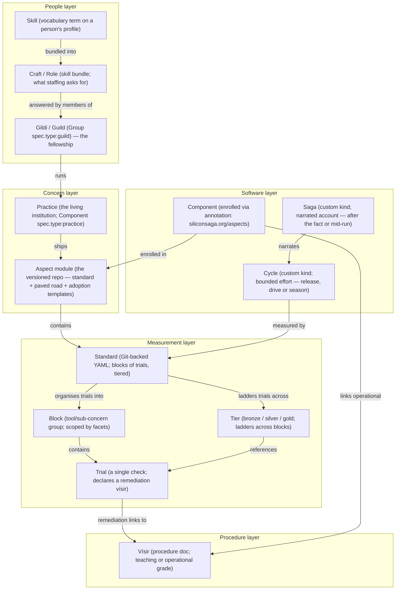
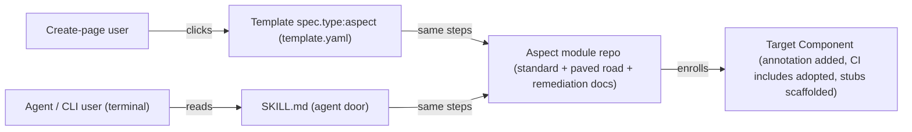
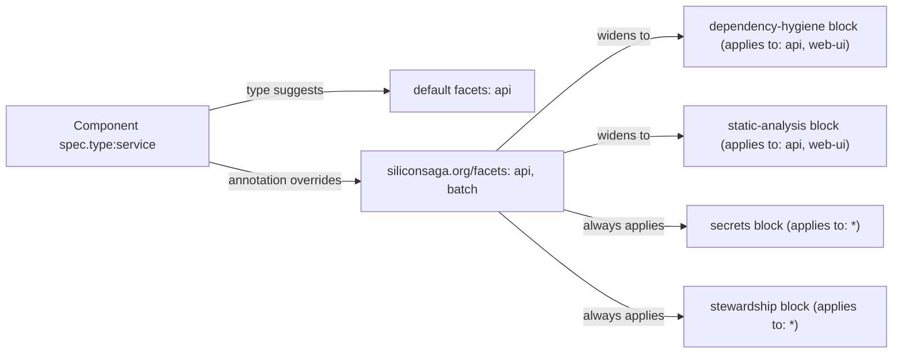

# Guildhall model — entity relationships

How the five Guildhall layers map onto Backstage entity kinds and relate to each other.

## Concept map

```mermaid
graph TD
    subgraph "People layer"
        SKILL["Skill (vocabulary term on a person's profile)"]
        CRAFT["Craft / Role (skill bundle; what staffing asks for)"]
        GILDI["Gildi / Guild (Group spec.type:guild) — the fellowship"]
    end

    subgraph "Concern layer"
        PRACTICE["Practice (the living institution; Component spec.type:practice)"]
        ASPECT["Aspect module (the versioned repo — standard + paved road + adoption templates)"]
    end

    subgraph "Measurement layer"
        STANDARD["Standard (Git-backed YAML; blocks of trials, tiered)"]
        BLOCK["Block (tool/sub-concern group; scoped by facets)"]
        TIER["Tier (bronze / silver / gold; ladders across blocks)"]
        TRIAL["Trial (a single check; declares a remediation vísir)"]
    end

    subgraph "Procedure layer"
        VISAR["Vísir (procedure doc; teaching or operational grade)"]
    end

    subgraph "Software layer"
        COMPONENT["Component (enrolled via annotation: siliconsaga.org/aspects)"]
        CYCLE["Cycle (custom kind; bounded effort — release, drive or season)"]
        SAGA["Saga (custom kind; narrated account — after the fact or mid-run)"]
    end

    SKILL -->|"bundled into"| CRAFT
    CRAFT -->|"answered by members of"| GILDI
    GILDI -->|"runs"| PRACTICE
    PRACTICE -->|"ships"| ASPECT
    ASPECT -->|"contains"| STANDARD
    STANDARD -->|"organises trials into"| BLOCK
    STANDARD -->|"ladders trials across"| TIER
    BLOCK -->|"contains"| TRIAL
    TIER -->|"references"| TRIAL
    TRIAL -->|"remediation links to"| VISAR
    COMPONENT -->|"enrolled in"| ASPECT
    COMPONENT -->|"links operational"| VISAR
    CYCLE -->|"measured by"| STANDARD
    SAGA -->|"narrates"| CYCLE
```

## The split that carries the model

> **Crafts are what people do. Aspects are what components adopt. Standards are what they must then uphold.**

- A **craft** (Role) is demand-side: what a staffing request asks for.
- An **aspect** is supply-side: what a component takes on when it enrolls.
- A **standard** is the bar: a set of checks, organized by tool (blocks) and maturity (tiers).

## Where the model is rendered

The relationships above are plain annotations and entity links — nothing here needs a custom kind beyond `Cycle` and `Saga`. The `gildi` plugin reads them back as composed entity pages, so the same edge is visible from both ends:

| Surface | Reads |
|---|---|
| Guild page — Charter, crest, Chronicle | the guild's practices, aspects, and recent Cycles/Sagas |
| Practice page — Practice + **Adopters** cards | every Component enrolled in the practice's aspect, and the version each adopted |
| Component page — **Aspects** card | the same enrollment from the component's side, plus whether its version is the practice's current release |

The last two are one relationship viewed from opposite directions. Currency comes from comparing a component's `siliconsaga.org/aspect-versions` against the practice's `siliconsaga.org/module-release` — an equality check, so a component reads as *behind* but never by how far. Nothing here evaluates trials: tier badges remain unbuilt, and the component card reserves the space rather than inventing a rating.

## Adoption — two doors, one module

```mermaid
flowchart LR
    PORTAL["Create-page user"] -->|"clicks"| TEMPLATE["Template spec.type:aspect (template.yaml)"]
    AGENT["Agent / CLI user (terminal)"] -->|"reads"| SKILL_MD["SKILL.md (agent door)"]
    TEMPLATE -->|"same steps"| MODULE["Aspect module repo (standard + paved road + remediation docs)"]
    SKILL_MD -->|"same steps"| MODULE
    MODULE -->|"enrolls"| COMPONENT2["Target Component (annotation added, CI includes adopted, stubs scaffolded)"]
```

## Facets — solving the multi-natured component

```mermaid
flowchart LR
    C["Component spec.type:service"] -->|"type suggests"| DEF["default facets: api"]
    C -->|"annotation overrides"| OVR["siliconsaga.org/facets: api, batch"]
    OVR -->|"widens to"| B1["dependency-hygiene block (applies to: api, web-ui)"]
    OVR -->|"widens to"| B2["static-analysis block (applies to: api, web-ui)"]
    OVR -->|"always applies"| B3["secrets block (applies to: *)"]
    OVR -->|"always applies"| B4["stewardship block (applies to: *)"]
```
